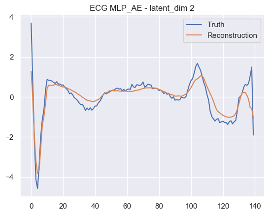

# deep-aion

This project gathers different deep learning models for time series (classification, anomaly detection, generation...)

## Getting Started

### Prerequisites

* python3,
* pytorch,
* Numpy, pandas, matplotlib, seaborn.

## Models

The [models.py](models.py) file contains all the implemented models. Here is the list:

* MLP_AE: A multi layer perceptron autoencoder,
* CNN_AE: A convolutional 1D autoencoder,
* LSTM_AE: A long short term memory autoencoder,
* MLP_VAE: A multi layer perceptron variational autoencoder.

## Data

* ECG5000

## Running the tests

Python script [run.py](run.py).

```bash
python run.py
```

## Results

### ECG5000

#### MLP_AE


